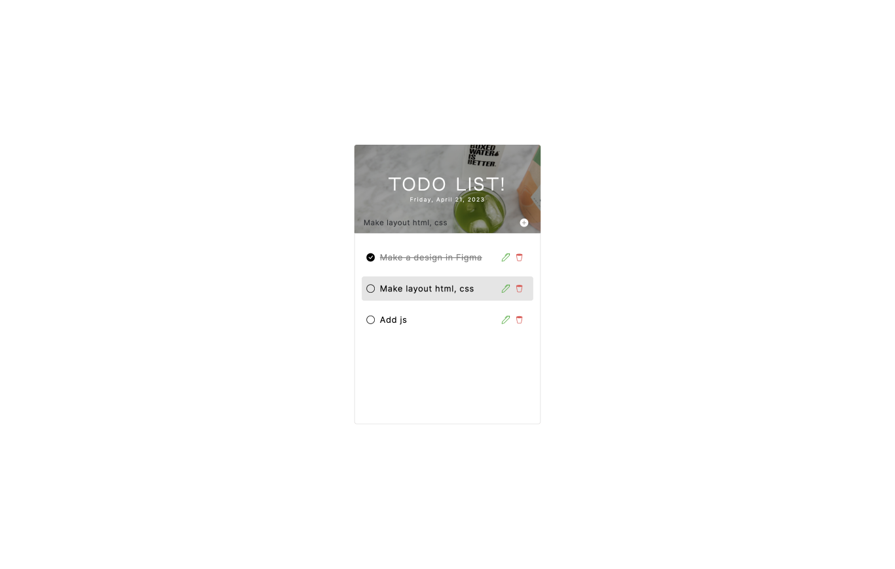

# ToDoList on JavaScript

## Introduction

The ToDoList project is a great example of using HTML, CSS, and JavaScript to create a complete application. This application allows users to create a list of tasks and track their progress.
 

## Technology Stack
- HTML
- CSS
- JavaScript
 

## Features
- Local storage for saving tasks
- Display of current time and date
- Error message prompt when trying to add an empty task or adding a task that already exists
 

## View

